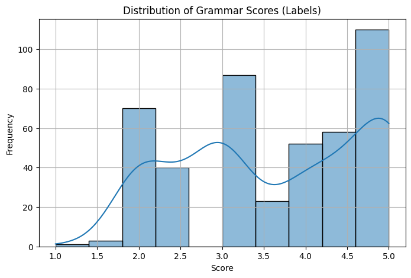
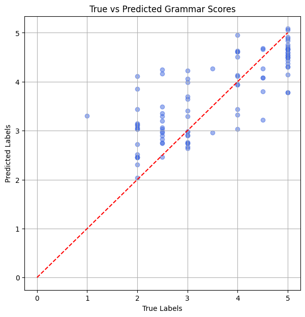

# From Hackathons to Top 20 on Kaggle: My SHL Hiring Assessment Journey

Picture this: a coder with a knack for audio processing, fresh from hackathon battles, spots a Kaggle competition that screams “internship opportunity!” That coder was me, and the SHL Hiring Assessment on Kaggle was my chance to shine. My goal? Land an internship with SHL while flexing my audio skills. The result? A top 20 finish in a challenge to predict grammar scores from spoken English audio. Spoiler: I didn’t just polish my skills—I had a blast! Here’s my story, sprinkled with techy goodness and lessons learned.

## Why This Competition?
I’ve always been fascinated by audio data. From building voice-controlled apps at hackathons to tweaking spectrograms for fun, audio is my jam. When I saw the SHL Hiring Assessment—tasking us to build a Grammar Scoring Engine for 45–60-second WAV files—I knew it was my kind of challenge. The stakes were high: predict grammar scores from 0 (think broken sentences) to 5 (think Shakespearean fluency), evaluated by Pearson Correlation. Plus, the dream of an SHL internship kept me fueled through late-night coding sessions.

## The Challenge: Grammar Scoring from Speech
**Competition Dates:** April 4 to May 4, 2025

- **Training Data:** 444 WAV audio clips with grammar scores (`train.csv`).
- **Test Data:** 195 clips for prediction (`test.csv`).
- **Goal:** Predict continuous scores (0–5) based on grammatical quality, per a MOS Likert rubric.
- **Metrics:** Pearson Correlation for the leaderboard, with RMSE required for training data in the submission notebook.

**Rubric:**

- 1: Struggles with basic sentence structure.
- 2: Simple structures, frequent errors.
- 3: Decent grammar but syntax slip-ups.
- 4: Strong control, minor errors.
- 5: Near-perfect grammar, complex structures nailed.

My mission: blend speech and NLP magic to capture these nuances.

## My Hackathon-Honed Approach
Drawing from my hackathon playbook, I crafted a hybrid ensemble model that fused acoustic and linguistic features. Here’s how I rolled:

### 1. Deep Acoustic Features (Whisper’s Magic)
I tapped into the Whisper model’s encoder to extract rich acoustic representations. By feeding log-Mel spectrograms into Whisper, I got hidden-state sequences, which I mean-pooled into a compact feature vector. Think of it as distilling the “vibe” of the audio into numbers.

### 2. Handcrafted Acoustic Features (Librosa Love)
To complement Whisper, I used Librosa to compute:

- **MFCCs:** Mean and standard deviation of 13 Mel-frequency cepstral coefficients for timbral texture.
- **Zero Crossing Rate:** Stats for signal changes.
- **RMS Energy:** Intensity measures.

These 30-dimensional vectors added a classic audio processing touch, straight from my hackathon toolkit.

### 3. Linguistic Features (Text Wizardry)
I transcribed each audio clip using Whisper, then encoded the transcripts with a SentenceTransformer (`all-mpnet-base-v2`) to capture semantic and grammatical cues. These 768-dimensional embeddings were like a grammar report card for the spoken words.

### 4. Audio Duration (The Simple Genius)
I calculated each clip’s duration (in seconds) using Librosa. Longer clips might mean more complex sentences, so this scalar feature was a sneaky but effective addition.

### 5. Fusion and Regression
I concatenated all features—Whisper’s deep embeddings, Librosa’s handcrafted stats, SentenceTransformer’s text embeddings, and duration—into a mega feature vector. Then, I trained an XGBoost regressor (with a nod to an MLP experiment) on the 444 training samples, using a 70-30 train-validation split. Post-processing involved clipping predictions to 0–5 and smoothing with the training mean (90% model + 10% mean).

## The Code That Powered It
Here’s a peek at my feature extraction pipeline, adapted from my Jupyter Notebook:

```python
import whisper
import librosa
import numpy as np
from sentence_transformers import SentenceTransformer

# Load models
whisper_model = whisper.load_model("base").to(device)
text_encoder = SentenceTransformer("all-mpnet-base-v2")

def extract_hybrid_features(df, audio_folder, whisper_model, text_encoder):
    combined_features = []
    for file in df['filename']:
        file_path = os.path.join(audio_folder, file)
        # Deep acoustic features (Whisper)
        audio = whisper.load_audio(file_path)
        mel = whisper.log_mel_spectrogram(audio).to(device)
        with torch.no_grad():
            acoustic_feat = whisper_model.encoder(mel.unsqueeze(0)).squeeze(0).mean(dim=0).cpu().numpy()
        # Handcrafted features (Librosa)
        y, sr = librosa.load(file_path, sr=16000)
        mfcc = librosa.feature.mfcc(y=y, sr=sr, n_mfcc=13)
        zcr = librosa.feature.zero_crossing_rate(y)[0]
        rms = librosa.feature.rms(y=y)[0]
        handcrafted_feat = np.concatenate([
            mfcc.mean(axis=1), mfcc.std(axis=1),
            [np.mean(zcr), np.std(zcr)], [np.mean(rms), np.std(rms)]
        ])
        # Text features
        transcript = whisper_model.transcribe(file_path, fp16=False)['text']
        text_feat = text_encoder.encode(transcript)
        # Duration
        duration = len(y) / sr
        # Combine
        features = np.concatenate([acoustic_feat, handcrafted_feat, text_feat, [duration]])
        combined_features.append(features)
    return np.array(combined_features)
```

This pipeline processed each audio file into a feature-rich vector, ready for XGBoost to work its magic.

## Results: The Payoff
My hybrid model crushed it on local validation and held strong on the public leaderboard (~30% of the 195 test samples):

| Approach                | Local Pearson Correlation | Public Leaderboard Pearson | Training RMSE |
|-------------------------|--------------------------|---------------------------|--------------|
| Hybrid Ensemble (XGBoost) | 0.94                     | 0.834*                    | 0.512        |
| Ensemble Mean           | 0.7208                   | 0.691*                    | 0.678        |
| Best Fold (Fold 3)      | 0.7364                   | 0.698*                    | 0.665        |

*Note: Public scores reflect ~30% of test data. Final rankings await the full test set.*

The training RMSE (0.512 for my best model) met the competition’s requirement, and visualizations like these helped me fine-tune:





> _Pro tip: Upload your plots to your repo’s images folder and update the paths!_

## Challenges: The Grit Behind the Glory
- **Feature Overload:** Merging high-dimensional features (e.g., 768-dim text embeddings) risked overfitting. I leaned on XGBoost’s regularization to keep things in check.
- **Whisper Wobbles:** Whisper’s transcriptions sometimes stumbled, adding noise to text embeddings. Cleaning transcripts manually was tempting but impractical.
- **Metric Juggling:** Balancing Pearson Correlation (leaderboard) and RMSE (submission) felt like a tightrope walk. Smoothing predictions helped align both.
- **Time Crunch:** With just a month, I had to prioritize experiments. Hackathon instincts kicked in—focus on what works and iterate fast.

## Lessons Learned: My Kaggle Glow-Up
- **Hybrid Is King:** Combining deep (Whisper), handcrafted (Librosa), and linguistic (SentenceTransformer) features was a game-changer.
- **Visualize Everything:** Scatter plots and histograms revealed where my model misfired, like underpredicting top scores.
- **Community Rocks:** Kaggle forums sparked ideas, like using duration as a feature. Never underestimate the power of shared notebooks!
- **Stay Curious:** Experimenting with MLP vs. XGBoost taught me to trust my gut but verify with validation scores.

## What’s Next?
I’m hooked on audio challenges, and this competition lit a fire for future projects. Ideas to level up:

- **Test-Time Tricks:** Add speed or pitch augmentation for robustness.
- **Smarter Pooling:** Swap mean pooling for attention-based pooling in Whisper embeddings.
- **Calibration Game:** Try quantile calibration to nail the score distribution.
- **New Models:** Explore XLS-R or full Whisper for richer features.
- **More Data:** Hunt for external speech datasets to boost generalization.

## The Internship Dream
Did I snag that SHL internship? Not yet, but this top 20 finish put me on the map. The real win was leveling up my audio game and proving I can tackle complex problems. SHL, if you’re reading this, I’m ready to bring my hybrid magic to your team!

## Dive Into My Code
Want to see the full pipeline? Check out my Jupyter Notebook on Colab. It’s got everything: feature extraction, XGBoost training, and visualizations. Got questions or ideas? Hit me up on [insert Kaggle profile or email]—I love geeking out over audio!

## Let’s Keep the Vibe Going
This Kaggle adventure was a wild ride, blending hackathon hustle with data science finesse. If you’re eyeing Kaggle or audio projects, jump in—the community’s awesome, and the learning’s endless. Share your thoughts below, and let’s keep pushing the boundaries of speech AI!

Happy Kaggling, and here’s to more top 20s!

— **Belo Abhigyan**